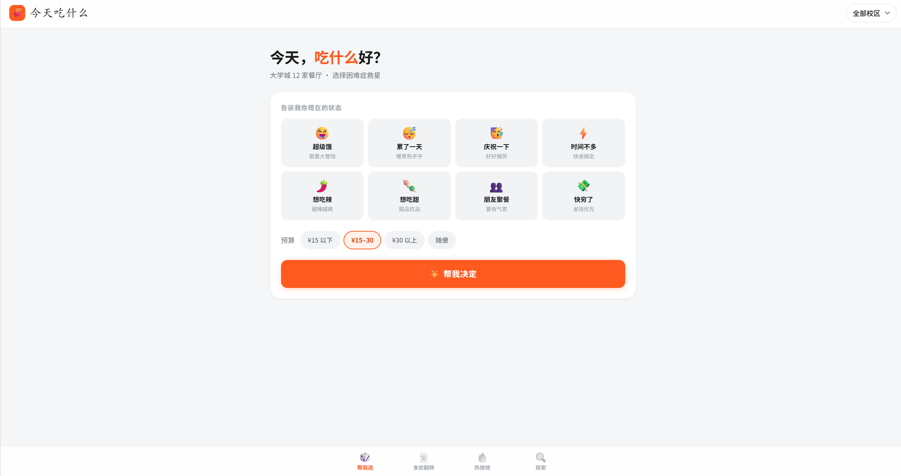
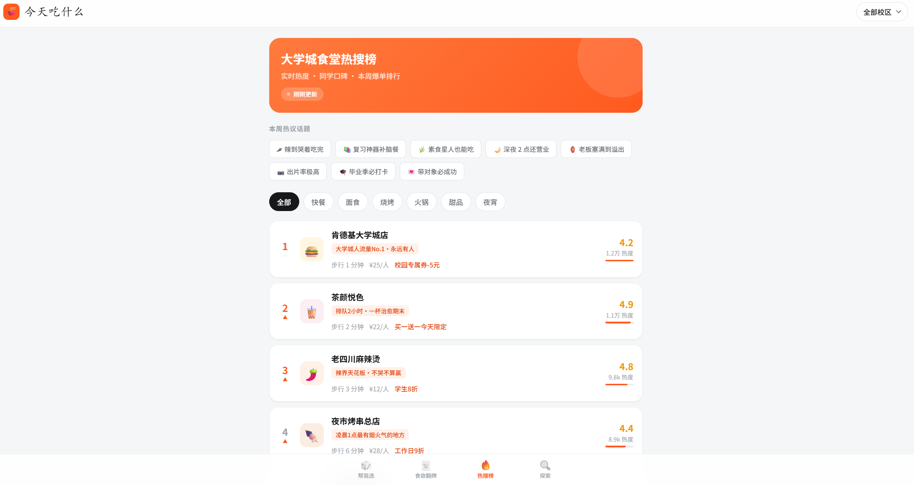

# 今天吃什么 · 大学城美食地图

> 面向大学城学生的选餐决策工具，解决"不知道吃什么"这件每天都要发生一次的小事。

**🔗 在线体验：<https://xingyue-zheng.github.io/food-map/>**

|  |  |
|---|---|
|  |  |
| **帮我选** — 选心情和预算，直接给一个结果 | **热搜榜** — 热度排行与学生口碑标签 |

---

## 项目背景

某高校联盟（5 所大学）周边聚集了大量餐饮商户，但学生普遍面临"吃什么"的决策困境：信息分散在各个平台，评价体系面向大众而非学生，缺少"人均 15 以内 / 步行 5 分钟 / 有学生折扣"这类真正影响学生决策的维度。

本项目用一个纯前端网页回应这个场景——不做又一个点评平台，而是做一个**替你做决定**的工具。

## 核心功能

| 模块 | 做什么 |
|---|---|
| 🎲 帮我选 | 选心情（超级饿 / 累了一天 / 快穷了…）+ 预算，直接给一个结果和推荐理由，不给列表 |
| 🃏 食欲翻牌 | 左右滑动的卡片流，靠直觉快速排除，右滑即出详情 |
| 🔥 热搜榜 | 热度排行 + 学生口碑标签（「¥10 干掉所有外卖·性价比之王」「凌晨 3 点还亮灯」） |
| 🔍 探索 | 按分类、价格、距离、评分筛选与搜索 |

顶栏校区切换对以上四个模块同时生效。

## 技术实现

- **原生 HTML / CSS / JavaScript**，无框架、无构建步骤、无 npm 依赖
- **单文件**：全部代码在 `index.html` 内，约 1100 行
- **零外部请求**：不加载任何 CDN、字体或图片资源，打开即渲染，断网也能跑
- **移动端优先**：`safe-area-inset` 适配刘海屏，`prefers-reduced-motion` 降级动画
- 部署于 GitHub Pages

### 设计系统

样式不是一页一套，而是先定义再复用：

- **Token 层**：品牌色 / 中性灰阶 / 圆角 / 阴影 / 间距全部收敛为 CSS 自定义属性
- **组件层**：`.chip`、`.tag`、`.seg-item`、`.btn` 四个原语覆盖全站所有标签、筛选器和按钮
- **配色纪律**：只有一个品牌色（橙），评分用金色、优惠用橙色，其余一律中性灰——层级靠字号字重表达，不靠颜色

### 交互实现

- 手写触摸 / 鼠标拖拽引擎：位移跟手、角度联动、方向判定（阈值 80px）、不足阈值回弹
- 卡片栈三层景深，滑走后重排
- 支持撤回上一次选择

## 本地运行

不需要任何依赖，但因为用了 `file://` 下受限的特性，建议起一个静态服务：

```bash
git clone https://github.com/Xingyue-Zheng/food-map.git
cd food-map
python -m http.server 8000
```

然后打开 <http://localhost:8000>。

## 已知限制

这是一个**前端原型**，需要明确说明的部分：

- 餐厅数据为 **12 条硬编码模拟数据**，写在 `index.html` 的 `D` 数组里，非真实商户信息
- 热度值、评价、"实时更新"均为静态模拟，不存在数据源或后端
- "导航前往"只弹提示，未接入任何地图服务
- 收藏状态存在内存中，刷新即丢失

如果要接真实数据，`D` 数组的字段结构就是现成的接口契约，替换数据源即可，渲染层无需改动。

## 目录结构

```
food-map/
├── index.html   # 全部代码：结构 / 样式 / 逻辑 / 数据
└── README.md
```

## 关于 AI 辅助

本项目使用 Claude 辅助设计与开发。
